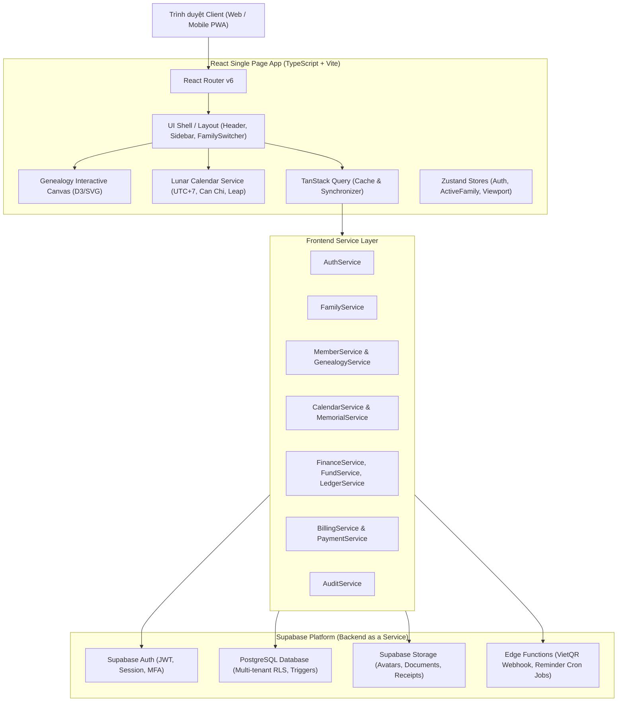
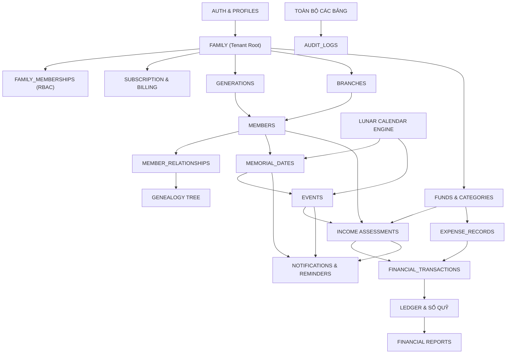

# KẾ HOẠCH TRIỂN KHAI HỆ THỐNG: GIA PHẢ GIA TỘC
# Technical Implementation Plan & Architectural Blueprint
# Project: Gia Phả Gia Tộc | Slogan: "Lưu giữ cội nguồn – Kết nối các thế hệ"

---

## 1. TỔNG QUAN DỰ ÁN (PROJECT OVERVIEW)

### 1.1. Mục Tiêu Sản Phẩm
Hệ thống **Gia Phả Gia Tộc** là nền tảng quản lý gia phả số đa gia tộc (Multi-tenant Family Platform), kết hợp tương tác cây phả hệ trực quan, quản lý lịch âm dương, ngày giỗ tổ tiên, sự kiện họ tộc, hệ thống tài chính - quỹ gia tộc chuẩn xác tuyệt đối (Double-entry Ledger Integrity), và phân hệ quản lý gói dịch vụ thuê bao (Subscription & Billing).

### 1.2. Đối Tượng Sử Dụng
1. **Trưởng tộc / Hội đồng gia tộc (OWNER / ADMIN)**: Khởi tạo gia tộc, phân quyền thành viên, quản lý gói dịch vụ, kiểm soát tài sản và dòng họ.
2. **Ban Gia Phả (GENEALOGY_ADMIN)**: Quản lý các thế hệ (đời), chi phái, nhánh họ, thông tin tiểu sử thành viên, cây gia phả.
3. **Ban Tài Chính & Thủ Quỹ (TREASURER)**: Lập đợt thu quỹ, gán mức thu theo chi/đời, ghi nhận thu tiền, lập phiếu chi, theo dõi sổ quỹ.
4. **Ban Kiểm Soát (APPROVER)**: Duyệt các khoản chi, kiểm soát tính minh bạch của quỹ họ tộc.
5. **Ban Khánh Tiết & Sự Kiện (EVENT_MANAGER)**: Quản lý ngày giỗ, lễ tết, giỗ tổ họ, mừng thọ, khánh thành nhà thờ tổ.
6. **Thành viên & Con cháu gia tộc (MEMBER / VIEWER)**: Xem cây gia phả, tra cứu ngày giỗ, nhận thông báo sự kiện, đóng góp quỹ trực tuyến, tra cứu lịch sử minh bạch.

### 1.3. Các Phân Hệ Cốt Lõi (Core Modules)
- **AUTH & ONBOARDING**: Đăng ký, đăng nhập, mời thành viên, tạo gia tộc.
- **FAMILY MANAGEMENT**: Đa gia tộc, thông tin nhà thờ họ, từ đường, nguyên quán.
- **GENEALOGY TREE & MEMBERS**: Cây phả hệ SVG tương tác, quản lý thế hệ, chi nhánh, quan hệ cha-con, vợ-chồng.
- **LUNAR CALENDAR & MEMORIALS**: Lịch âm Việt Nam (UTC+7, Can Chi, Tháng nhuận), ngày giỗ lặp theo âm lịch.
- **EVENTS & REMINDERS**: Sự kiện họ tộc, ngân sách sự kiện, thông báo đa kênh (30-15-7-3-1 ngày).
- **FINANCE & LEDGER**: Đa quỹ, khoản thu định mức (Assessment), thu thực tế (Payment), duyệt chi (Approval), đóng góp (Contribution), tài trợ (Sponsorship), sổ quỹ bất biến (Immutable Ledger) & đảo ngược bút toán (Reversal).
- **SUBSCRIPTION & BILLING**: Gói cước (Free, Family, Gia Tộc, Dòng Họ, Premium), thanh toán VietQR, hóa đơn Invoices, Read-only Mode khi hết hạn.
- **RBAC & SECURITY**: Phân quyền 8 cấp độ, Supabase Row Level Security (RLS) bảo vệ đa gia tộc.
- **AUDIT TRAIL**: Ghi nhận toàn bộ thao tác hệ thống.

---

## 2. CÔNG NGHỆ & NGĂN XẾP PHẦN MỀM (TECHNOLOGY STACK)

- **Frontend Framework**: React 18 / 19 + TypeScript (Strict Mode) + Vite
- **UI Library & Styling**: Tailwind CSS + shadcn/ui + Radix UI + Lucide React
- **Genealogy Graph Visualization**: D3.js / SVG Canvas Engine (Zoom, Pan, Expand/Collapse, Mini-map)
- **State Management**: TanStack Query v5 (Server State Caching) + Zustand (Local Client & Tree Viewport State)
- **Form & Validation**: React Hook Form + Zod (Validation Schema)
- **Vietnamese Lunar Engine**: `vietnamese-lunar-calendar` / Ho Ngoc Duc Astronomical Algorithm (UTC+7, Leap Month Handling)
- **Backend & CSDL**: Supabase (PostgreSQL 15+, Supabase Auth, Row Level Security, Storage Buckets, Database Functions)
- **Testing Suite**: Vitest (Unit/Integration Test) + Playwright (E2E Test) + Supertest / PostgreSQL pgTAP (RLS & Schema Test)

---

## 3. KIẾN TRÚC HỆ THỐNG (SYSTEM ARCHITECTURE)



---

## 4. PHÂN ĐỊNH MODULES NGHIỆP VỤ (FEATURE MODULES)

1. `AUTH`: Đăng ký, đăng nhập email/mật khẩu, quên mật khẩu, cập nhật profile.
2. `FAMILY`: Quản lý thực thể gia tộc, thông tin nhà thờ tổ, gia huy, địa chỉ từ đường.
3. `MEMBERSHIP & RBAC`: Quản lý vai trò (8 roles: `OWNER`, `ADMIN`, `GENEALOGY_ADMIN`, `TREASURER`, `APPROVER`, `EVENT_MANAGER`, `MEMBER`, `VIEWER`), lời mời tham gia gia tộc.
4. `GENERATION`: Quản lý các thế hệ/đời (Đời 1 - Thủy tổ, Đời 2, Đời 3...).
5. `BRANCH`: Quản lý cây phân cấp Chi phái (Chi trưởng, Chi thứ, Phân chi, Nhánh họ).
6. `MEMBERS`: Quản lý hồ sơ nhân khẩu, tiểu sử, ngày sinh, ngày mất, nơi an táng.
7. `RELATIONSHIP`: Quản lý các mối quan hệ quan hệ cha-con, mẹ-con, vợ-chồng, con nuôi.
8. `GENEALOGY TREE`: Hiển thị cây gia phả tương tác, lọc theo đời/chi, tìm kiếm nút gia phả.
9. `LUNAR CALENDAR`: Bộ máy tính toán chuyển đổi Dương lịch $\leftrightarrow$ Âm lịch Việt Nam, Can Chi ngày/tháng/năm, xử lý tháng nhuận.
10. `MEMORIAL`: Quản lý ngày giỗ tổ tiên, tự động tính ngày Dương lịch hàng năm theo chu kỳ lặp âm lịch.
11. `EVENT`: Quản lý sự kiện họ tộc (Giỗ tổ, Họp mặt đầu xuân, Khánh thành từ đường, Mừng thọ).
12. `REMINDER`: Cấu hình thông báo tự động trước 30, 15, 7, 3, 1 ngày qua Email / In-App / Web Push.
13. `FUNDS`: Quản lý danh mục quỹ (Quỹ họ, Quỹ xây nhà thờ, Quỹ khuyến học, Quỹ phụng dưỡng).
14. `INCOME CATEGORIES & EXPENSE CATEGORIES`: Danh mục phân loại khoản thu/chi.
15. `INCOME ASSESSMENT`: Quản lý nghĩa vụ thu tiền định mức, gán mức thu nhanh cho 86+ thành viên theo đời/chi.
16. `PAYMENT & INCOME TRANSACTIONS`: Ghi nhận thực thu, liên kết nghĩa vụ thu, cập nhật trạng thái `PENDING` $\rightarrow$ `PARTIAL` $\rightarrow$ `PAID`.
17. `EXPENSE & APPROVAL`: Quản lý đề xuất chi, quy trình phê duyệt (`DRAFT` $\rightarrow$ `PENDING_APPROVAL` $\rightarrow$ `APPROVED` $\rightarrow$ `POSTED`).
18. `CONTRIBUTIONS & SPONSORSHIPS`: Quản lý đóng góp tự nguyện và các khoản tài trợ công đức lớn (Bảng vàng vinh danh).
19. `LEDGER & REVERSAL`: Sổ quỹ kế toán kép bất biến, không xóa giao dịch, hỗ trợ bút toán đảo ngược kèm lý do.
20. `REPORTS`: Báo cáo tài chính đa chiều theo thời gian, theo quỹ, theo sự kiện, theo chi phái.
21. `SUBSCRIPTION & BILLING`: Quản lý gói cước dịch vụ gia tộc, thanh toán VietQR, kiểm soát hạn mức tính năng, Read-only Mode.
22. `AUDIT LOGS`: Nhật ký kiểm toán bất biến theo dõi toàn bộ hành động tạo/sửa/duyệt/đảo ngược.

---

## 5. SƠ ĐỒ PHỤ THUỘC MODULE (MODULE DEPENDENCY)



---

## 6. KẾ HOẠCH TRIỂN KHAI THEO CÁC GIAI ĐOẠN (IMPLEMENTATION PHASES)

### Phase 0: Project Discovery & Architecture Verification
- **Goal**: Xác thực toàn bộ tài liệu kỹ thuật, chuẩn bị repository và môi trường Supabase.
- **Tasks**: Khởi tạo project React + Vite + TypeScript, cấu hình Tailwind & shadcn/ui, thiết lập kết nối Supabase Local/Cloud.
- **DoD**: Khởi chạy `npm run dev` hiển thị UI Shell trống không lỗi lint/type.

### Phase 1: Database Migration, RLS Policies & Extensions
- **Goal**: Triển khai toàn bộ CSDL PostgreSQL trên Supabase.
- **Tasks**: Thực thi `DATABASE_SCHEMA.sql`, thiết lập 27 tables, enums, triggers, stored functions, 40+ RLS policies.
- **DoD**: Toàn bộ migration chạy thành công với exit code 0; RLS test suite xác nhận multi-tenant isolation.

### Phase 2: Authentication, Profile & Family Onboarding
- **Goal**: Quản lý tài khoản, đăng nhập, mời thành viên, tạo gia tộc.
- **Tasks**: Xây dựng `LoginPage`, `RegisterPage`, `CreateFamilyPage`, `FamilySwitcher`, Supabase Auth session listener.
- **DoD**: Người dùng đăng ký $\rightarrow$ tạo gia tộc $\rightarrow$ tự động gắn vai trò `OWNER` $\rightarrow$ truy cập Dashboard.

### Phase 3: Generations, Branches, Members & Interactive Genealogy Tree
- **Goal**: Quản lý nhân khẩu gia tộc và cây phả hệ trực quan.
- **Tasks**: CRUD thế hệ, chi nhánh, hồ sơ thành viên; xây dựng Canvas cây gia phả D3.js hỗ trợ zoom, pan, expand/collapse, xuất PDF/PNG.
- **DoD**: Render cây gia phả 6 đời, 7 chi, 50+ thành viên mượt mà với 60fps.

### Phase 4: Vietnamese Lunar Calendar Engine, Memorials & Events
- **Goal**: Lịch âm dương Can Chi, ngày giỗ lặp âm lịch và quản lý sự kiện họ tộc.
- **Tasks**: Tích hợp thuật toán thiên văn Hồ Ngọc Đức; module ngày giỗ tự tính ngày Dương theo từng năm; quản lý sự kiện và ngân sách sự kiện.
- **DoD**: Test cases chuyển đổi âm/dương, tháng nhuận (Leap month) và tính ngày giỗ 2026, 2027, 2028 PASS 100%.

### Phase 5: Finance Core (Funds, Assessments, Payments, Expenses & Approvals)
- **Goal**: Hệ thống quản lý tài chính gia tộc minh bạch, chuẩn mực kế toán.
- **Tasks**: Quản lý đa quỹ; gán mức thu định mức hàng loạt cho 86+ thành viên; ghi nhận thu tiền (Atomic DB function); quy trình duyệt chi 4 bước (`DRAFT` $\rightarrow$ `PENDING` $\rightarrow$ `APPROVED` $\rightarrow$ `POSTED`).
- **DoD**: Test integrity tài chính: Số dư quỹ tăng/giảm chính xác, không cho phép xóa giao dịch POSTED.

### Phase 6: Immutable Ledger, Reversals, Sponsorships & Reports
- **Goal**: Sổ quỹ bất biến, bút toán đảo ngược, bảng vàng công đức và báo cáo tài chính đa chiều.
- **Tasks**: Xây dựng màn hình Sổ quỹ; chức năng tạo Reversal transaction kèm lý do; Bảng vàng tài trợ; Báo cáo doanh thu, chi phí, công nợ theo chi phái.
- **DoD**: Báo cáo tài chính khớp 100% với Sổ quỹ lũy kế.

### Phase 7: Subscription & Billing System
- **Goal**: Quản lý gói cước dịch vụ gia tộc (Free, Family, Gia Tộc, Dòng Họ, Premium).
- **Tasks**: Trang chọn gói `/pricing`, quản lý thuê bao `/app/billing`, tích hợp tạo mã VietQR, kiểm soát hạn mức tính năng và chế độ Read-Only Mode.
- **DoD**: Gia tộc hết hạn thuê bao chuyển sang Read-only Mode an toàn, không mất dữ liệu.

### Phase 8: Notification Engine, Audit Logs & System Settings
- **Goal**: Trung tâm thông báo, nhắc giỗ tự động, phân quyền RBAC và nhật ký kiểm toán.
- **Tasks**: Xây dựng `NotificationsPage`, cấu hình nhắc lịch 30-15-7-3-1 ngày, ma trận phân quyền 8 vai trò, màn hình tra cứu Audit log.
- **DoD**: Mọi hành động nhạy cảm đều sinh bản ghi trong `audit_logs`.

### Phase 9: Import/Export, Testing, Security Audit & Deployment
- **Goal**: Hoàn thiện tính năng nhập/xuất dữ liệu, kiểm thử toàn diện và bàn giao sản phẩm.
- **Tasks**: Import CSV/Excel có Preview đối soát; chạy Vitest + Playwright E2E; kiểm tra bảo mật OWASP/RLS; đóng gói và triển khai Vercel/Supabase.
- **DoD**: 100% tiêu chí trong Definition of Done được nghiệm thu.

---

## 7. CẤU TRÚC ĐIỀU HƯỚNG & ROUTING (ROUTING PLAN)

```
/                                   -> Landing Page / Giới thiệu sản phẩm
/login                              -> Đăng nhập
/register                           -> Đăng ký tài khoản
/forgot-password                    -> Quên mật khẩu
/reset-password                     -> Đặt lại mật khẩu
/pricing                            -> Bảng giá gói dịch vụ

/onboarding
  └── /create-family                -> Wizard khởi tạo gia tộc mới
  └── /join-family                  -> Tham gia gia tộc qua mã mời

/app                                -> Protected Application Shell
  ├── /dashboard                    -> Tổng quan gia tộc (KPIs, Lịch âm, Giỗ sắp tới)
  ├── /genealogy                    -> Cây gia phả tương tác (Zoom, Pan, Filter)
  ├── /members                      -> Danh sách thành viên (Bảng & Thẻ)
  ├── /members/:id                  -> Hồ sơ chi tiết thành viên (6 Tabs)
  ├── /calendar                     -> Lịch gia tộc (Âm - Dương song song)
  ├── /memorials                    -> Danh bạ ngày giỗ tổ tiên
  ├── /events                       -> Danh sách sự kiện họ tộc
  ├── /events/:id                   -> Chi tiết sự kiện & danh sách tham dự
  ├── /events/:id/budget            -> Quản lý ngân sách sự kiện
  │
  ├── /finance                      -> Tổng quan tài chính gia tộc
  ├── /finance/funds                -> Danh mục các quỹ
  ├── /finance/income               -> Danh sách đợt thu & Khoản phải thu
  ├── /finance/income/record        -> Ghi nhận thu tiền (Thu quỹ)
  ├── /finance/expenses             -> Quản lý khoản chi & Phê duyệt chi
  ├── /finance/contributions        -> Đóng góp tự nguyện của con cháu
  ├── /finance/sponsorships         -> Bảng vàng tài trợ & Công đức lớn
  ├── /finance/ledger               -> Sổ quỹ gia tộc (Kế toán kép)
  ├── /finance/transactions/:id     -> Chi tiết giao dịch & Đảo ngược bút toán
  ├── /finance/reports              -> Báo cáo tài chính tổng hợp
  ├── /finance/reports/detailed     -> Báo cáo chi tiết đối soát đa chiều
  │
  ├── /billing                      -> Tổng quan gói dịch vụ & hạn sử dụng
  ├── /billing/usage                -> Chi tiết sử dụng & giới hạn hạn mức
  ├── /billing/checkout             -> Thanh toán quét mã VietQR tự động
  ├── /billing/invoices             -> Danh sách hóa đơn thuê bao
  ├── /billing/invoices/:id         -> Chi tiết hóa đơn chuẩn A4 điện tử
  ├── /notifications                -> Trung tâm thông báo
  ├── /audit                        -> Nhật ký kiểm toán hệ thống (Audit Trail)
  └── /settings
      ├── /family                   -> Cài đặt thông tin gia tộc & Từ đường
      ├── /permissions              -> Ma trận phân quyền RBAC
      ├── /reminders                -> Cấu hình thời gian nhắc giỗ & sự kiện
      └── /notifications            -> Cấu hình kênh thông báo cá nhân

/admin                              -> Hệ thống Quản trị Doanh thu SuperAdmin
  ├── /revenue                      -> Tổng quan doanh thu MRR, ARR & phân tích Churn
  ├── /subscriptions                -> Quản trị thuê bao toàn bộ các gia tộc
  ├── /transactions                 -> Quản trị luồng thanh toán VietQR ngân hàng
  └── /reconciliation               -> Nhật ký đối soát tự động
```

---

## 8. KIẾN TRÚC THÀNH PHẦN (COMPONENT ARCHITECTURE)

- **Layout Components**: `AppLayout`, `Header`, `Sidebar`, `MobileBottomNav`, `FamilySwitcher`, `Breadcrumbs`, `UserMenu`.
- **Genealogy Components**: `GenealogyTreeCanvas`, `TreeNodeCard`, `TreeToolbar` (Zoom, Pan, Reset, Export), `GenerationFilterBar`, `BranchSelector`, `AddMemberModal`, `RelationshipModal`.
- **Calendar & Memorial Components**: `DualCalendarGrid`, `LunarMonthView`, `CanChiBadge`, `MemorialCard`, `MemorialCountdown`, `AddMemorialModal`, `EventCard`, `EventBudgetWidget`.
- **Finance Components**: `FundBalanceCard`, `AssessmentCampaignTable`, `BulkAssessmentModal`, `RecordIncomeForm`, `ExpenseApprovalCard`, `LedgerDataTable`, `TransactionDetailModal`, `ReversalConfirmDialog`, `GoldenDonorBoard`, `IncomeExpenseCharts`.
- **Billing Components**: `PlanCardGrid`, `SubscriptionStatusHero`, `UsageLimitBar`, `VietQRPaymentModal`, `InvoiceDataTable`.
- **Common & Feedback Components**: `DataTable` (Sort, Filter, Pagination), `ConfirmDialog`, `StatusBadge`, `EmptyState`, `SkeletonLoader`, `PermissionDenied`, `ReadOnlyBanner`.

---

## 9. KIẾN TRÚC DỊCH VỤ (SERVICE ARCHITECTURE)

```typescript
// Danh sách các Service Class chuẩn mực tại src/services/:
1. AuthService: signIn(), signUp(), signOut(), resetPassword(), getCurrentUser()
2. FamilyService: getFamilies(), getFamilyById(), createFamily(), updateFamily(), getMemberships(), updateRole()
3. MemberService: getMembers(), getMemberById(), createMember(), updateMember(), deleteMember(), exportMembers()
4. GenealogyService: getFamilyTree(), addRelationship(), removeRelationship(), validateNoCycle()
5. LunarCalendarService: solarToLunar(), lunarToSolar(), getCanChi(), isLeapMonth(), getNextMemorialSolarDate()
6. MemorialService: getMemorials(), createMemorial(), updateMemorial(), getUpcomingMemorials()
7. EventService: getEvents(), createEvent(), updateEvent(), getEventBudgetAnalytics()
8. FundService: getFunds(), createFund(), updateFund(), getFundBalance()
9. IncomeService: getAssessments(), bulkCreateAssessments(), recordPayment()
10. ExpenseService: getExpenses(), createExpense(), approveExpense(), rejectExpense()
11. ContributionService: getContributions(), addContribution()
12. SponsorshipService: getSponsorships(), addSponsorship()
13. LedgerService: getLedgerEntries(), getTransactionDetail(), reverseTransaction()
14. ReportService: getFinancialSummaryReport(), getCategoryReport(), getBranchComparisonReport()
15. BillingService: getPlans(), getActiveSubscription(), createInvoice(), checkFeatureEntitlement()
16. NotificationService: getNotifications(), markAsRead(), getReminderPreferences(), updatePreferences()
17. AuditService: getAuditLogs(), logAction()
```

---

## 10. LUỒNG DỮ LIỆU CỐT LÕI (CORE DATA FLOWS)

### 10.1. Luồng Gán Mức Thu Hàng Loạt & Ghi Nhận Thanh Toán (Assessment $\rightarrow$ Payment $\rightarrow$ Ledger)
1. **Lập Đợt Thu**: Thủ quỹ tạo đợt thu (VD: *Quỹ Giỗ Tổ 2027*, Mức 500.000đ).
2. **Gán Nhanh**: Hệ thống duyệt 86 thành viên theo Đời/Chi, tạo 86 bản ghi trong `income_assessments` với `amount_due = 500.000`, `amount_paid = 0`, `status = 'PENDING'`. *(Không làm thay đổi số dư quỹ)*.
3. **Ghi Nhận Thu Tiền**: Khi thành viên đóng 500.000đ tiền mặt hoặc VietQR:
   - Gọi Stored Function `record_income_payment(...)` trên PostgreSQL.
   - Tạo bản ghi trong `financial_transactions` (`type = 'INCOME'`, `amount = 500.000`, `status = 'POSTED'`).
   - Cập nhật `income_assessments`: `amount_paid = 500.000`, `amount_remaining = 0`, `status = 'PAID'`.
   - Cập nhật số dư `funds.current_balance = funds.current_balance + 500.000`.
   - Ghi nhật ký vào `audit_logs`.
   - **Tất cả các bước nằm trong 1 Transaction nguyên tử (ACID)**.

### 10.2. Luồng Đề Xuất Chi & Phê Duyệt Chi (Expense $\rightarrow$ Approval $\rightarrow$ Ledger)
1. Thủ quỹ tạo phiếu chi: `expense_records` với `amount = 2.000.000đ`, `status = 'PENDING_APPROVAL'`. *(Chưa trừ tiền quỹ)*.
2. Trưởng tộc / Người duyệt (`APPROVER`) kiểm tra chứng từ $\rightarrow$ Nhấn "Duyệt chi":
   - Gọi Stored Function `approve_expense_record(...)`.
   - Chuyển `expense_records.status = 'APPROVED'` rồi `'POSTED'`.
   - Tạo `financial_transactions` (`type = 'EXPENSE'`, `amount = 2.000.000đ`, `status = 'POSTED'`).
   - Giảm số dư `funds.current_balance = funds.current_balance - 2.000.000đ`.
   - Ghi nhận `audit_logs`.

### 10.3. Luồng Đảo Ngược Giao Dịch Sai Sót (Reversal Transaction Flow)
1. Giao dịch đã `POSTED` **tuyệt đối không bị DELETE vật lý**.
2. Khi phát hiện ghi nhầm: Kế toán thực hiện "Hủy/Đảo ngược giao dịch" và nhập lý do bắt buộc.
3. Gọi Stored Function `reverse_financial_transaction(original_tx_id, reason)`:
   - Tạo giao dịch đảo ngược `financial_transactions` (`type = 'REVERSAL'`, số tiền đối ứng, tham chiếu `reference_transaction_id`).
   - Điều chỉnh lại số dư quỹ và trạng thái khoản thu liên quan.
   - Ghi nhận đầy đủ audit trail.

---

## 11. KIẾN TRÚC BẢO MẬT & PHÂN QUYỀN (SECURITY ARCHITECTURE)

1. **Multi-tenant Isolation qua RLS**: Mọi bảng chứa dữ liệu nghiệp vụ (`members`, `events`, `funds`, `financial_transactions`...) đều có cột `family_id` và được bảo vệ bởi Row Level Security.
   ```sql
   CREATE POLICY tenant_isolation_policy ON members
   FOR ALL USING (
     family_id IN (
       SELECT family_id FROM family_memberships 
       WHERE user_id = auth.uid() AND status = 'ACTIVE'
     )
   );
   ```
2. **RBAC Server-Side Enforcement**: Quyền hạn được kiểm tra ở mức Database Function và RLS (Ví dụ: Chỉ vai trò `OWNER`/`ADMIN`/`TREASURER` mới được ghi nhận thu tiền).
3. **Storage Security**: Buckets (`avatars`, `documents`, `receipts`) phân quyền theo `family_id` trong đường dẫn lưu trữ.
4. **Zero-Secret Leakage**: Anon key chỉ có quyền truy vấn theo RLS; Service role key chỉ dùng trong migration/seed backend.

---

## 12. KIẾN TRÚC LỊCH ÂM VIỆT NAM (LUNAR CALENDAR ARCHITECTURE)

- **Chuẩn Múi Giờ**: `Asia/Ho_Chi_Minh` (UTC+7 cố định).
- **Cấu Trúc Lưu Trữ Ngày Giỗ & Ngày Mất**:
  - `date_of_death_solar`: Ngày mất dương lịch (nếu biết).
  - `lunar_day` (1-30), `lunar_month` (1-12), `lunar_year` (Năm âm), `is_leap_month` (boolean cờ tháng nhuận).
- **Xử Lý Lặp Lại Ngày Giỗ**:
  - Hàng năm, `LunarCalendarService` nhận vào `(lunar_day, lunar_month, target_solar_year, is_leap_month)` và tính ra chính xác ngày Dương lịch tổ chức giỗ trong năm đó.
  - Hỗ trợ đầy đủ trường hợp tháng nhuận theo quy tắc cổ truyền Việt Nam.

---

## 13. CHIẾN LƯỢC KIỂM THỬ (TEST STRATEGY)

- **Unit Tests**:
  - `lunar-calendar.spec.ts`: Kiểm thử chuyển đổi 100+ mốc ngày âm dương, can chi, tháng nhuận.
  - `genealogy.spec.ts`: Kiểm thử thuật toán chống vòng lặp quan hệ cha-con (Cycle detection).
  - `financial-calculator.spec.ts`: Kiểm thử tính toán số dư, assessment remaining, phân bổ tỷ lệ.
- **Integration & RLS Tests**:
  - Kiểm thử cô lập dữ liệu: User của Gia tộc A không thể đọc/ghi dữ liệu Gia tộc B.
  - Kiểm thử tính nguyên tử tài chính: Rollback giao dịch nếu có bất kỳ bước nào thất bại.
- **E2E Critical Flow Tests**:
  - Luồng 1: Đăng ký $\rightarrow$ Tạo gia tộc $\rightarrow$ Thêm đời 1 & 2 $\rightarrow$ Xem Cây gia phả.
  - Luồng 2: Tạo khoản thu $\rightarrow$ Gán mức thu 86 thành viên $\rightarrow$ Thu tiền $\rightarrow$ Kiểm tra Sổ quỹ.
  - Luồng 3: Tạo phiếu chi $\rightarrow$ Duyệt chi $\rightarrow$ Kiểm tra số dư quỹ $\rightarrow$ Đảo ngược bút toán.

---

## 14. KẾ HOẠCH TRIỂN KHAI & MÔI TRƯỜNG (DEPLOYMENT)

- **Environment**:
  - `Development`: Local Vite Dev Server + Supabase Local (Docker).
  - `Staging`: Vercel Preview Deployments + Supabase Staging Project.
  - `Production`: Vercel Edge Network + Supabase Production (Frankfurt/Singapore Region, Daily Automated Backups).
- **Environment Variables**:
  ```env
  VITE_SUPABASE_URL=https://xyzcompany.supabase.co
  VITE_SUPABASE_ANON_KEY=eyJhbGciOi...
  VITE_APP_ENV=production
  ```

---

## 15. OPEN QUESTIONS & ASSUMPTIONS

1. **Giả định về Cổng Thanh toán**: Giai đoạn 1 triển khai Cổng thanh toán quét mã VietQR tự động (Chuyển khoản liên ngân hàng kèm mã nội dung giao dịch duy nhất). Cổng VNPay/MoMo được thiết kế sẵn interface để kích hoạt trong giai đoạn 2.
2. **Giả định về Lời mời gia tộc**: Người được mời có thể tham gia qua mã mời (Invite Code) hoặc đường link chia sẻ có token xác thực 7 ngày.
3. **Giả định về Dung lượng miễn phí**: Gói Free hỗ trợ tối đa 30 thành viên và 500MB lưu trữ tài liệu/ảnh.

---

## 16. BẢNG KIỂM TRA ĐỒNG NHẤT CHÉO (CONSISTENCY CHECK)

| Đồng nhất 36 Tables giữa Schema & Plan | ✅ PASS | Mọi bảng (bao gồm 14 bảng Billing Enterprise) đều có trong `DATABASE_SCHEMA.sql` |
| Đồng nhất 8 Roles trong RBAC | ✅ PASS | `OWNER`, `ADMIN`, `GENEALOGY_ADMIN`, `TREASURER`, `APPROVER`, `EVENT_MANAGER`, `MEMBER`, `VIEWER` |
| Đồng nhất 52 Màn hình Google Stitch | ✅ PASS | 100% màn hình trong `SCREEN_MAP.md` (46 Desktop + 6 Mobile) đều có Route & Page tương ứng |
| Phân hệ Billing Enterprise Lifecycle | ✅ PASS | `FAMILY` $\rightarrow$ `SUBSCRIPTION` $\rightarrow$ (`PLAN`, `TRIAL`, `USAGE`, `INVOICES` $\rightarrow$ `INVOICE_ITEMS`, `PAYMENTS` $\rightarrow$ `PAYMENT_EVENTS`, `REFUNDS`, `BILLING_AUDIT`) |
| RLS Multi-tenant cho 100% bảng nghiệp vụ | ✅ PASS | Có `family_id` và RLS policy bảo vệ đầy đủ |
| Tách biệt hoàn toàn Assessment vs Payment | ✅ PASS | `amount_due` $\neq$ `amount_paid`, tiền chỉ vào quỹ khi giao dịch POSTED |
| Xử lý Tháng nhuận trong Lịch Âm | ✅ PASS | Có cột `is_leap_month` và engine hỗ trợ chu kỳ âm lịch |
| Chống xóa giao dịch tài chính đã POSTED | ✅ PASS | Ràng buộc `ON DELETE RESTRICT` và cấm xóa vật lý, chỉ cho phép Reversal |
